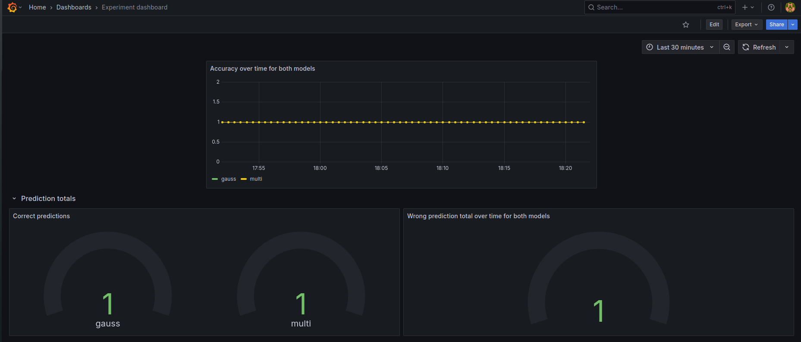

# Introduction
We chose to experiment with a new model type. Currently, we use a Gaussian Naive Bayes classifier to determine a review's stance. However, our review data is discrete, meaning that a Multinomial classifier might be more appropriate as it can handle discrete data better. As such, we pose the following hypothesis:

>A Multinomial Naive Bayes classifier outperforms a Gaussian Naive Bayes classifier given the same training conditions. 

The new model architecture will improve classification accuracy. We use the F1 score found during training and the rolling accuracy reported by users who submit reviews to our dataset to test our hypothesis. An additional feature we implemented for this project was to allow users to correct classifications and submit reviews to our dataset through the frontend UI, giving us a look into the real-world classification accuracy of our models. We can use this information to determine then if our new Multinomial Naive Bayes model performs better than the original Gaussian Naive Bayes

## Methodology
We use the default parameters for both models and provide them with the same data and training setup. We use A/B testing to test our hypothesis. We set up two versions of our `model-service` service, each hosting a different model. Then, we redirect users to one of the two versions when they issue a `/predict` request to `app-service.` Under the hood, `app-service` randomly picks one of the two model services and records the relevant statistics for that model. The statistics are then exported and accessible through Prometheus.

Through Prometheus `app-service` exposes the following metrics for a given model:
| Metric | Description |
|--------|-------------|
| predictions | Total Number of predictions |
| failed predictions | Total Number of failed (due to technical error) predictions |
| correct_pred_total | Total Number of correctly classified reviews (as defined by the user) |
| wrong_pred_total | Total Number of wrongly classified reviews (as defined by the user) | 
| last_req_time | Number of time it took for the last request to complete |
| accuracy | Rolling accuracy of the model |

Out of all metrics, `correct_pred`, `wrong_pred`, and `accuracy` are the most relevant, giving us an oracle into the model's classification performance. At a future point in time, we will export the data collected by Prometheus and analyze it to determine if there are significant differences between the Gaussian and Multinomial Naive Bayes models. We can evaluate the significance of the results by carrying out a statistical significance test. In particular, we plan on using the Student T-test with a p-value threshold of `0.05`, meaning significant results would have a p-value lower than 0.05. The Student T-test has limited requirements for the shape and qualities of the data and provides a sound judgment on the significance of the results.

Once we have established which model performs better, we issue a temporary patch to our `app-service` to direct everyone to the specific `model-service` and update the code to remove the old model later.

We handle configuring the `model-service` endpoints, model loading, and A/B switch probability through environment variables.  

## Visualization

We track the progress of our experiment using a Grafan dashboard. You can find the definition in `grafana/dashboards/experiment_dashboard.json`. Specifically we track the metrics we already identified as relevant over time, aggregated over the two model types.
