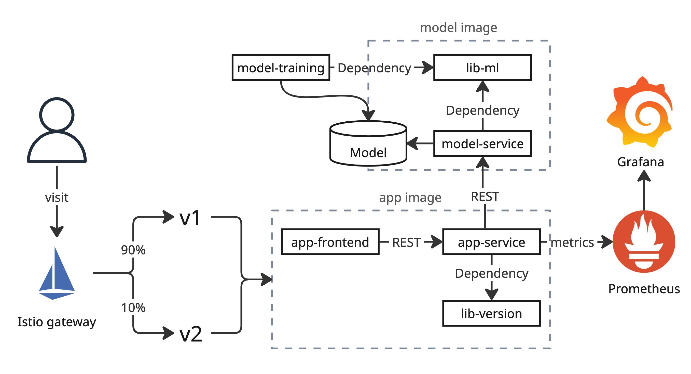

# Deployment Documentation

This document describes our deployment structure, data flow, and the connections between components.  
After reading, you should be able to contribute to design discussions.

## Table of Contents

- [Deployment Documentation](#deployment-documentation)
  - [Table of Contents](#table-of-contents)
  - [Repositories](#repositories)
  - [Repository Content](#repository-content)
    - [lib-ml](#lib-ml)
    - [lib-version](#lib-version)
    - [app-service](#app-service)
    - [app-frontend](#app-frontend)
    - [model-service](#model-service)
    - [model-training](#model-training)
    - [operation](#operation)
  - [Architecture Overview](#architecture-overview)
    - [Deployment Structure](#deployment-structure)
    - [Data Flow](#data-flow)
    - [Deployed Resource Types and Relations](#deployed-resource-types-and-relations)
  - [Deployment](#deployment)
    - [Dockerized](#dockerized)
      - [System Overview](#system-overview)
      - [Secrets](#secrets)
    - [Vagrant + Kubernetes](#vagrant--kubernetes)
      - [Vagrant File Overview](#vagrant-file-overview)
      - [Configuration Summary](#configuration-summary)
      - [Ansible Provisioning](#ansible-provisioning)
      - [Networking](#networking)
      - [Ansible Groups](#ansible-groups)
      - [Ansible Playbooks](#ansible-playbooks)
  - [Monitoring](#monitoring)
    - [Prometheus](#prometheus)
    - [Grafana](#grafana)

## Repositories

This repository contains documentation for our deployment structure.

In addition, there are six other repositories containing the components of the application:

- **lib-ml** — [GitHub](https://github.com/remla25-team13/lib-ml)
- **lib-version** — [GitHub](https://github.com/remla25-team13/lib-version)
- **app-service** — [GitHub](https://github.com/remla25-team13/app-service)
- **app-frontend** — [GitHub](https://github.com/remla25-team13/app-frontend)
- **model-service** — [GitHub](https://github.com/remla25-team13/model-service)
- **model-training** — [GitHub](https://github.com/remla25-team13/model-training)

## Repository Content

### lib-ml

Shared pre-processing logic reused by both model-training and model-service.

- Cleans and normalizes input text
- Removes URLs and punctuation
- Shared between training and inference

### lib-version

Utility library providing version information at runtime, used by app-service.

- Provides a `VersionUtil` class to retrieve the package version
- Useful for logs, debug output, or API responses
- Version is automatically aligned with Git tags

### app-service

Backend service (Flask) for the REMLA25 project. Handles REST API calls and communicates with model-service.

**API Endpoints:**
- `GET /` — Greeting message
- `POST /create` — Non-functional create operation
- `GET /read` — Non-functional read operation
- `PUT /update` — Non-functional update operation
- `DELETE /delete` — Non-functional delete operation
- `GET /version/app-service` — App-service version
- `GET /version/lib-version` — lib-version version
- `POST /predict` — Forwards review for sentiment prediction
- `POST /submit` — Submits review and correctness label
- `GET /metrics` — Prometheus metrics (prediction counts, model accuracy)

### app-frontend

Angular frontend for interacting with app-service.

- Custom environment configuration (`/environments/environment.ts`)
- Interacts with app-service API
- Users can submit reviews and correct predictions

### model-service

Flask service that serves the latest model artifacts from model-training.

- `GET /version/app-service` — App-service version
- `POST /predict` — Sentiment prediction

### model-training

Machine learning training pipeline for sentiment analysis.

- Loads restaurant reviews dataset
- Preprocesses data using lib-ml
- Trains and evaluates sentiment model
- Versions and releases model for deployment
- DVC pipeline and ML testing

### operation

Composes all services and contains additional information and collaboration references.

## Architecture Overview



The diagram above visually represents the described architecture, showing the flow of requests, dependencies between services, and integration with monitoring tools. The dynamic routing decision (90/10 split) is marked, clarifying where traffic management occurs.

### Deployment Structure

- **Istio Gateway:** Entry point for all user traffic. It manages and routes incoming requests to different service versions.
- **Traffic Routing:** 
  - **Dynamic Routing Decision:** The Istio VirtualService splits incoming traffic: 90% to `v1`, 10% to `v2`. This enables safe releases and A/B testing.
- **Application Components:**
  - **app-frontend:** Handles user requests, communicates with `app-service` via REST.
  - **app-service:** Core logic, depends on `lib-version`.
  - **model-service (v2 only):** Provides ML features, depends on `lib-ml`.
- **Dependencies:**
  - `app-service` → `lib-version`
  - `model-service` → `lib-ml`
- **Monitoring:**
  - **Prometheus:** Collects metrics from all services.
  - **Grafana:** Visualizes metrics for observability.

### Data Flow

1. **User Request:** User visits the application; request enters via Istio Gateway.
2. **Dynamic Routing:** Istio VirtualService routes 90% of requests to `v1`, 10% to `v2`.
3. **Service Interaction:**
    - `app-frontend` receives the request, calls `app-service`.
    - `app-service` calls `model-service` for ML tasks.
4. **Dependencies:** Each service uses its respective library for core logic.
5. **Metrics:** All services expose metrics, scraped by Prometheus and visualized in Grafana.

### Deployed Resource Types and Relations

- **Kubernetes Deployments:** `app-frontend`, `app-service`, `model-service`
- **Kubernetes Services:** Expose each deployment internally
- **Istio Gateway & VirtualService:** Manage ingress and traffic splitting
- **Prometheus & Grafana:** Monitoring and visualization stack

## Deployment

### Dockerized

Run the app using Docker Compose:

```sh
docker compose up --build
```

#### System Overview

Three Dockerized services orchestrated via Docker Compose:

1. **app-frontend**
   - Web-based UI
   - **Image:** `ghcr.io/remla25-team13/app-frontend:latest`
   - **Ports:** 4200
   - **Depends on:** app-service

2. **app-service**
   - Backend API
   - **Image:** `ghcr.io/remla25-team13/app-service:latest`
   - **Depends on:** model-service
   - **Secrets:** `auth_token` (for authentication with model-service)

3. **model-service**
   - ML model service
   - **Image:** `ghcr.io/remla25-team13/model-service:latest`
   - **Environment Variables:**
     - `VERSION` — Model version
     - `MODE` — Set to `PROD`
     - `PORT` — Port number
   - **Ports:** Exposes `MODEL_SERVICE_PORT`
   - **Secrets:** `auth_token` (shared with app-service)

#### Secrets

- **auth_token**
  - Stored in `./auth_token.txt`
  - Mounted into both app-service and model-service for authentication

### Vagrant + Kubernetes

**Requirements:**
- Host: macOS or Linux
- VirtualBox installed
- Vagrant installed

Start the application:

```sh
vagrant up
```

#### Vagrant File Overview

Defines a virtual environment with one control node and multiple worker nodes, provisioned with Ansible.

#### Configuration Summary

- **Worker Nodes:** Default 2 (configurable via `NODES`)
- **Base Image:** `bento/ubuntu-24.04`
- **Provisioner:** Ansible
- **Provider:** VirtualBox

#### Ansible Provisioning

- All nodes: `general.yml`
- Control node: `ctrl.yml`
- Each worker: `node.yml`

#### Networking

- **Private Network IPs:** Static, `192.168.56.100+`

#### Ansible Groups

- **Control Group:** `ctrl`
- **Worker Groups:** `node-1`, `node-2`

#### Ansible Playbooks

- **General:** Prepares all nodes for Kubernetes (SSH keys, swap, kernel modules, networking, packages, containerd, kubelet, kubeadm, kubectl, `/etc/hosts`, system services)
- **Ctrl:** Sets up Kubernetes control plane, initializes cluster, sets up kubeconfig, installs Flannel CNI, Helm, and `helm-diff`
- **Finalization:** Installs MetalLB, NGINX Ingress Controller, Kubernetes Dashboard, Istio, and Prometheus (with custom `ServiceMonitor`)
- **Node:** Joins worker nodes to the cluster, configures kubeconfig

## Monitoring

Monitoring helps us track the health and performance of our services.  
We use Prometheus to collect metrics and Grafana to visualize them.  
This setup makes it easy to spot issues and understand system behavior.

### Prometheus

Prometheus is a monitoring system and time series database.  
It scrapes metrics from endpoints (e.g., `localhost:8000/metrics`), stores the data, and allows querying with PromQL.

In our project, Prometheus supports model experiments by exposing and collecting metrics for both models.

### Grafana

Grafana is a visualization platform that queries Prometheus and displays metrics in dashboards.  
We use Grafana to monitor our system and visualize experiment results, including custom UIs for specific needs.