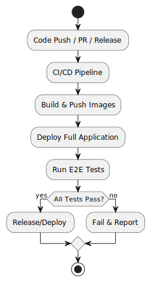

<!--
Extension Proposal Critically reflect on the current state of your project and identify one release-engineering-
related shortcoming of the project practices that you find the most critical, annoying, or error prone (related to an
assignment, e.g., the training or release pipelines, contribution process, deployment, or experimentation).
Document the identified shortcoming and describe its effect, a convincing argumentation is crucial. Describe
and visualize a project refactoring or an extension that would improve the situation. Link to information sources
that provide additional information, inspiration for your solution, or concrete examples for its realization. We expect
that you only cite respectable sources (e.g., research papers, quality blogs like Medium, tool websites, or popular
StackOverflow discussions). It is critical that you describe how you could test whether the changed design would
solve the identified shortcoming, i.e., how an experiment could be designed to measure the resulting effects
-->

<!-- 
Extension Proposal (The documentation refers to the docs/extension.md file)
Insufficient
The extension is unrelated to release engineering and focuses on an implementation aspect.

Poor
The extension is trivial, irrelevant for the project, or refers to an unimplemented assessment criterion.

Sufficient
- The documentation describes one release-engineering-related shortcoming of the project practices.
- A proposed extension addresses the shortcoming and is connected to one of the assignments. 
    For example, the training or release pipelines, contribution process, deployment, or experimentation.
- The extension is genuine and has not already been mentioned in any of the assignment rubrics.
- The documentation cites external sources that inspired the envisioned extension.

Good
- The shortcoming is critically reflected on and its negative effects get elaborated in detail.
- The presented extension improves the described shortcoming.
- The documentation explains how an improvement could be measured objectively in an experiment.

Excellent
- The presented extension is general in nature and applicable beyond the concrete project.
- The presented extension clearly overcomes the described shortcoming
-->

# Extension Proposal: Automated End-to-End (E2E) Deployment Verification

## Identified Shortcoming
Currently, our project autoamtes building, testing and deploying individual components. But it does not verify that a full deployment actually works as intended after a release. While we have CI for unit and integration tests, there is no pipeline that spins up and tests the entire stack in a clean enviroment and run tests against the combined and live system.

Likewise, a shortcoming is the lack of automated consistency checks for environment variables and configuration across our microservices. Each service have there own specific environment variables, but there is no way to ensure that these are aligned.

This has multiple negative effects:
- **Undetected Integration Failures:** Changes that pass component-level tests may still break the system when deployed together.
- **Manual Verification:** Team members must manually deploy and test the system, which is time-consuming and error-prone.
- **Delayed Feedback:** Bugs are often discovered late, sometimes after a release. Increasing the cost and effort of fixing them.
- **Reduced Confidence:** Contributors are less confident merging changes, slowing down development and releases.
- **Deployment Failures:** Services may fail to start or communicate due to missing or mismatched environment variables.

### Proposed Extension
An automated E2E Deployment Verification Pipeline would solve this problem. This will be an extra CI/CD pipeline step on every release or PR. It should run the whole sysem in a clean environment. And then run tests against the running services. It should fail then the E2E test fails. The is the total pipeline:

### Supporting Sources
- [What is End-to-End Testing? – CircleCI Blog](https://circleci.com/blog/what-is-end-to-end-testing/)
- [End-to-End Testing – Microsoft Code With Engineering Playbook](https://microsoft.github.io/code-with-engineering-playbook/automated-testing/e2e-testing/)
- [Running End-to-End Tests with GitHub Actions – Medium](https://medium.com/tomorrowapp/running-end-to-end-tests-with-github-actions-d45b70c032e6)
- [End-to-End (E2E) Testing – Katalon Blog](https://katalon.com/resources-center/blog/end-to-end-e2e-testing)

### How to Measure Improvement

**Experiment Design:**
- **Baseline:** Track the number of integration bugs found after release and the average time to detect/fix them before introducing the E2E pipeline.
- **After Extension:** Track the same metrics after implementing the E2E pipeline.
- **Objective Metrics:**
  - Number of post-release integration bugs (should decrease).
  - Time from PR merge to bug detection (should decrease).
  - Number of manual deployment/test steps required (should decrease).
  - Developer confidence (can be surveyed).

### General Applicability

This extension is **generalizable**: any multi service project with microservices, containers, or Kubernetes can benefit from automated E2E deployment verification. It is not specific to our codebase or assignments.